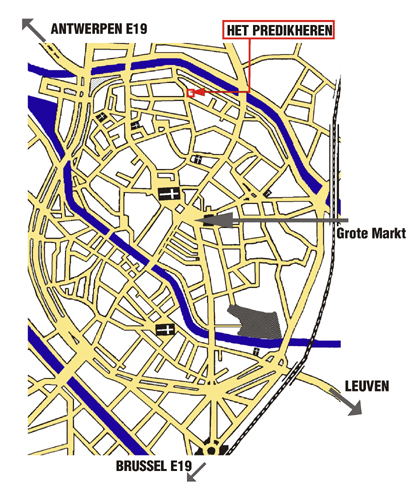

# Plan

### Eerste keer?

Welkom! Je vindt ons in het prachtig gerestaureerde Predikherenklooster ([route](https://g.page/HetPredikheren)), nu de bibliotheek van de stad Mechelen. De koffiebar van het predikheren wordt voor de gelegenheid omgetoverd tot ons jazz-café. Ook beschikt de bibliotheek over een uitzonderlijk mooie collectie (oude) jazzplaten. Ieder concert halen we enkele van deze parels naar beneden om u helemaal in de juiste sfeer te brengen.

Het Predikheren  
Zaal Mandela  
G. De Stassartstraat 88,  
2800 Mechelen

### Toegankelijkheid

Het Predikheren is toegankelijk voor rolstoelgebruiker.

### Parkeren

Je kan in de buurt parkeren in:

- Parking Tinel (Edgard Tinellaan 5) onder het gelijknamige nieuwbouwproject Tinel. Gelieve de uitgang 'Champetterke' te volgen.
- Parking Veemarkt (650m of 8min wandelen)
