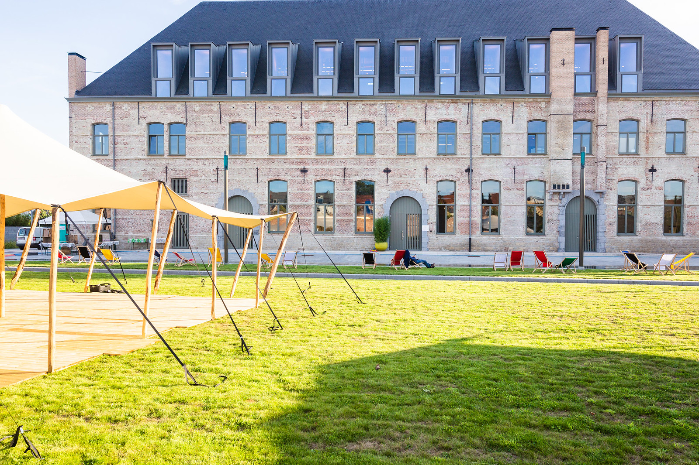

## Kalender

Hier vind je het overzicht van de aankomende en bevestigde optredens.

Standaard werken we met 2 sets per optreden. De eerste set start om {{ site.events.starttime|e }} (deuren om {{ site.events.doors }}), de tweede start op {{ site.events.starttime_set2 }} (deuren om {{ site.events.doors_set2 }}). Als je zeker wil zijn van een plaatsje, koop dan uw ticket vooraf en online via onze ticketshop. We hebben **geen** genummerde plaatsen, dus kom ook zeker op tijd.

<a class="btn-primary my-4 inline-block text-center mx-auto" href="{{ site.ticketshop.url }}">Naar de ticketshop</a>

