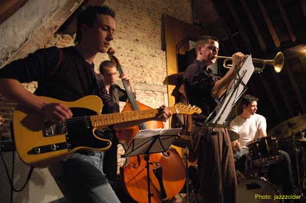
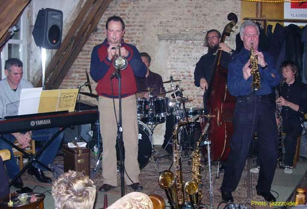

## Historiek van de Jazzzolder

### Hoe het begon

De huisbewaarders van het parochiecentrum van O.-L.-Vrouw o/d Dijle in de Refugie van Grimbergen, een eeuwenoud gebouw in het historische hart van Mechelen, kregen, toen ze er in 1997 hun intrek namen, de beschikking over een grandioze zolder, een luxe die ze wat graag met anderen wilden delen. Maar hoe? Na het nodige gepieker kwam het antwoord, nl een gezellige privé-ontmoetingsplek voor vrienden en waar jazzplaten en -CD's werden gedraaid door een echte "jazz-dj" met gigantische jazzknow-how. De eerste avonden werden georganiseerd, aanvankelijk dus voor een beperkt publiek van vrienden en ingewijden, een publiek dat evenwel snel uitbreiding nam; meer en meer vroegen ook jonge muzikanten om te mogen optreden.

Het nieuwe podium, zoveel was duidelijk, beantwoordde aan een dwingende behoefte. Mechelen, ooit de stek van legendarische jazzclubs zoals o.a. de Begijnenzolder en de New Standard, was voor liefhebbers van dit muziekgenre een braakland geworden. Het was dus onder een gunstig gesternte dat in 1998 de vzw Jazzzolder het licht zag.

Intussen had de zolder een ware transformatie ondergaan, waarin afgedankte banken, een geïmproviseerde toog en een goed uitgekiende belichting de toon zetten. Bezoekers en muzikanten waren het roerend eens: de met een uitstekende akoestiek gezegende zolder was een van de gezelligste jazzclubs van het land "en zelfs ver daarbuiten" (dixit o.a. Jef Neve).

Er werd niet alleen aan het interieur getimmerd. Occasionele concerten maakten plaats voor een volwassen programmering. Jazzliefhebbers uit Mechelen en ruime omstreken konden er onderhand hun klok op gelijkzetten: iedere tweede en vierde vrijdag van de maand was het verzamelen geblazen op ‘de zolder’ om er te luisteren naar prachtige optredens, en er hun (nieuwe) vrienden te zien.

### De Jazzzolder van 2006 tot 2019

De vzw Jazzzolder verkeert in blakende gezondheid. Het ledenaantal is in de loop der jaren gegroeid tot het huidige aantal van ongeveer 90. De groeiende achterban blijkt ook uit de grote belangstelling voor de website en de electronische nieuwsbrief, de voornaamste communicatiemiddelen van de Jazzzolder. De nieuwsbrief bijvoorbeeld wordt naar meer dan 1500 emailadressen verstuurd.

Samen met occasionele bezoekers kunnen de leden genieten van een kwalitatief sterk en vooral gevarieerd programma dat alle geledingen van de jazzmuziek overspant. Van traditionele bebop over fusion en free jazz tot improvisatiemuziek, alle genres komen aan bod.

Onder muzikanten heeft de jazzzolder zich een stevige reputatie verworven, en dit niet alleen vanwege het sfeervolle kader en het aandachtige publiek. De vzw maakt er een punt van alle artiesten op gelijke voet te behandelen, ongeacht naam en faam.

De waardering blijkt ook uit de gastenlijst van de Jazzzolder; meer dan negenhonderd muzikanten hebben al op het podium gestaan, velen zelfs meermaals. In de lijst zitten bekende namen uit de Belgische jazz, zoals Frank Vaganée, Chris Joris, Dré Pallemaerts, Tom Mahieu, Anja Kowalski, Etienne Richard, Jokke Schreurs, Gilbert Isbin.... Van de buitenlandse gasten onthouden we o.a. de Australische Kristen Cornwell, Luxemburger Pascal Schumacher en de Britse trompetlegende Harry Beckett. Ook in de rubriek improvisatiemuziek noteren we gevestigde namen, zoals André Goudbeek, Tatsuya Nakatani, Assif Tsahar, Peter Jacquemyn, Joe Fonda, Bart Maris, Enzo Rocco...

Toch wil de Jazzzolder in de allereerste plaats een podium bieden aan jonge muzikanten van hoofdzakelijk eigen bodem. Vaak gaat het om studenten of afgestudeerden van bekende muziekscholen, zoals het Brussels Conservatorium, het Leuvense Lemmens Instituut, de Antwerpse Jazzstudio, conservatoria uit Wallonië, Nederland, Frankrijk, Duitsland, Scandinavië en zelfs Oost-Europa. Heel wat van deze jongeren hebben zich intussen ontpopt tot grote beloften met uitzicht op een internationale doorbraak. Jef Neve, Robin Verheyen, Tutu Puoane, Bruno Vansina, Teun Verbruggen, Joachim Badenhorst, Ewout Pierreux, het zijn maar enkele namen van rijzende sterren die op het podium van de Mechelse Jazzzolder hebben gestaan. Zonder misplaatste pretentie durven we beweren dat het ook aan clubs zoals de Jazzzolder te danken is dat deze talenten zich kunnen ontwikkelen.

Op vrijdag 10 november 2006 echter verzamelden we een laatste keer op onze vertrouwde zolder. Noodgedwongen moesten we deze prachtige locatie verlaten.

Vrijdag 24 november vond het eerste concert plaats op onze nieuwe locatie. Het ging om een oude kapel op de Wollemarkt in het centrum van Mechelen, al luidde het officiële adres volgens de postbode Sint-Romboutskerkhof 2.

De vzw **[Contour](http://www.contourmechelen.be/)** (videokunsten) was graag bereid ons onderdak te verlenen. Jazzmuziek en videokunst onder één hoed, dat opende creatieve perspectieven.

_"Partir c'est mourir un peu",_ sprak ooit een Franse dichter. En inderdaad, het was met spijt in het hart en een schat aan mooie herinneringen dat we na acht fantastische jaren de deur van onze zolder dichttrokken. De nieuwe locatie oogde totaal anders, maar daarom niet minder sfeervol. Centraal gelegen, omringd door parkeerplaatsen, geen halsbrekende trappen, een ruim podium, een afzonderlijk café waar naar believen kon getaterd worden, het waren enkele evidente troeven.

Het werd voor iedereen wat wennen aan een jazzzolder op het gelijkvloers maar de nieuwe locatie op de Wollemarkt bood wel de ruimte en de mogelijkheden om onze club verder uit te bouwen.

De reacties op de "nieuwe jazzzolder" waren unaniem positief en lovend: _"het was of we daar al jaren zaten…"_.

Ook de muzikanten waren enthousiast over het "nieuwe podium".

Maar in oktober 2017 moest de jazzzolder opnieuw naar een andere locatie verhuizen; de eigenaar van de kapel verkocht het pand aan het Sint-Romboutskerkhof.

Het Onze Lieve Vrouwkoor bood ons daarop onderdak, zodat de concerten van de jazzzolder na 19 jaar toch verder kunnen plaats vinden.

_De **Refuge van Grimbergen** in de Onze-Lieve-Vrouwestraat te Mechelen behoorde tot de Norbertijnenabdij van Grimbergen sinds 1426 maar werd rond de 16e of 17e eeuw nieuw heropgebouwd. Ze verzekerde de link tussen de landelijke abdij en de stedelijke omgeving en diende als verblijfplaats voor reizende kloosterlingen en als verzamelpunt voor abdij-inkomsten. Hierdoor verwierf de refuge prestige bij de stedelingen._

_Het complex kwam tijdens de Franse Revolutie in privéhanden waardoor het een tijdje werd gebruikt als private woonst en later als school. Heden wordt het geheel gebruikt als parochiezaal en buurtcentrum bij de Onze-Lieve-Vrouw-over-de-Dijle kerk en voor de Mechelse jeugdbeweging Jamaswapi._

_Van de oorspronkelijke vier vleugels van het refugehuis bleven er twee 16- of 17de eeuwse bewaard. De vleugel links van de binnenkoer werd in 1886 vervangen. De vierde vleugel werd rond 1800 definitief afgebroken._

_Aan de zijde van de Onze-Lieve-Vrouwestraat op nr 52 werd een nieuw poortgebouw in blauwe hardsteen opgetrokken en op de gevel gedateerd 'anno 1777'. De siervazen er bovenop werden in 1990 gereconstrueerd naar een prent van Jean Baptist De Noter. _([bron](http://mechelen.mapt.be/wiki/Refugie_van_Grimbergen)).

### De Jazzzolder vandaag

In september 2019 kondigde zich opnieuw een verhuis aan; de jazzzolder is vaste resident geworden in **[Het Predikheren](https://hetpredikheren.mechelen.be/)**

De concerten gaan nu door in de zaal “Mandela” van Het Predikheren, Goswin De Stassartstraat 88 in Mechelen.

_Het Predikheren wordt een nieuwe culturele hotspot met veel functies. Naast de bibliotheek zal ook Jazzzolder er gevestigd zijn en zullen Creatief Schrijven, Vormingplus, De Nieuwe Weg, CVO Crescendo en CBE-Open school er activiteiten organiseren._

_Jazzzolder vzw wordt een vaste resident van Het Predikheren. In Zaal Mandela zal er elke tweede en vierde vrijdag van de maand een live concert plaatsvinden voor bezoekers._

_De jazzcollectie van de bibliotheek krijgt een prominente plek op de zolderverdieping van het gebouw en bezoekers zullen er af en toe zelf een plaatje kunnen opleggen. Het Mechels Cultuurcentrum zal vier keer per jaar Vinyl Sundays organiseren in Het Predikheren waarbij bekende artiesten hun favoriete platen uit de bibliotheekcollectie komen draaien._ (website van de Stad Mechelen).
